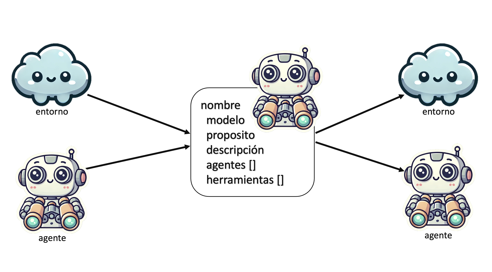
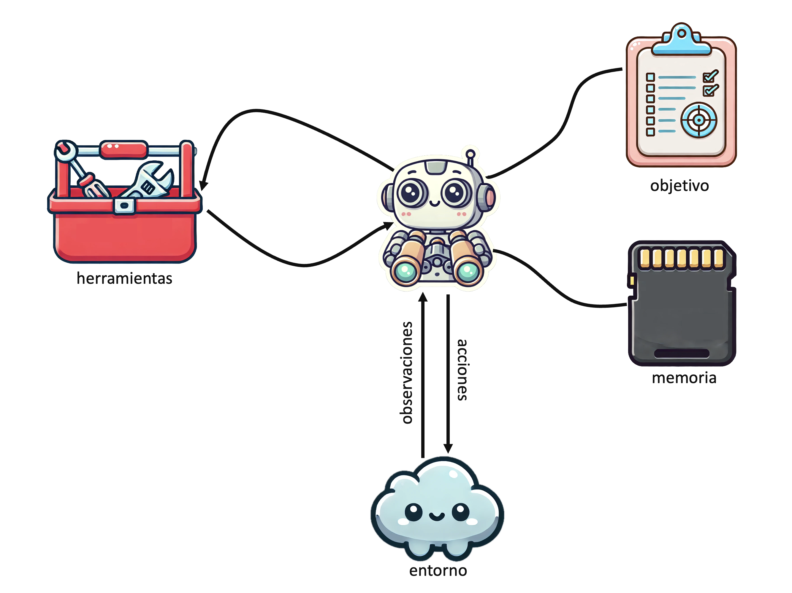
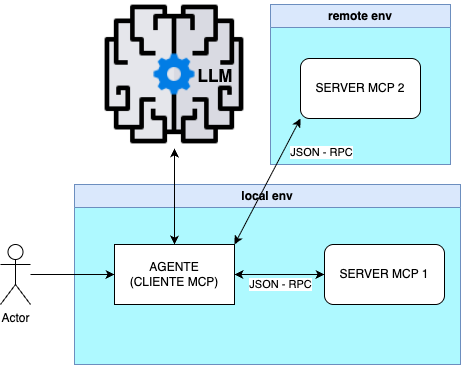
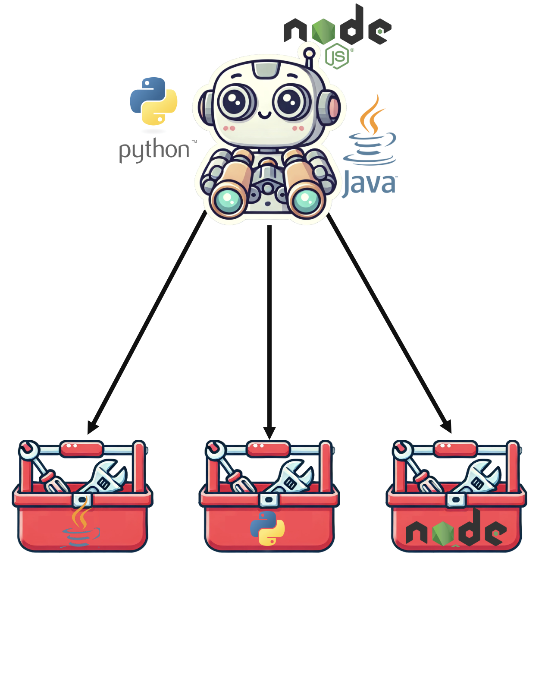
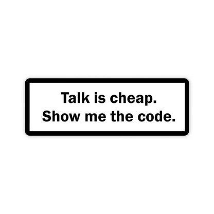

---

marp: true
theme: marping
paginate: false
title: Taller de Agentes con MCP
description: Introducción, implementación práctica y observabilidad de MCP
header: '🤖 Tech Day June 25 '
footer: 'Taller de Agentes con MCP'
--------------------------------------------------------------------------

<!-- _class: lead -->

<div class="columns">
<div>

# Taller de Agentes con MCP

</div>
<div>


</div>
</div>


---

<!-- _class: portrait -->
# Taller de Agentes con MCP

## Objetivos

* Introducir el concepto de agentes usando MCP. ¿Por qué es relevante MCP hoy?
* Implementar herramientas y agentes con Java, Python y JavaScript.
* Crear comunidad en ING

<!-- footer: 'Taller de Agentes con MCP🐤' -->
---

## 💻 Requisitos:

- Portátil personal con 16 GB de RAM o más (mejor si tiene GPU)

<div class="columns">
<div>

Con ollama:

- Ollama instalado: https://ollama.com/download
- Cargar y probar el modelo Qwen 2.5: ```$ ollama run qwen2.5```

</div>
<div>

Sin ollama:

- Conectar con Antropic, proporcionamos el api key

</div>
</div>


- Tener un IDE configurado para ejecutar proyectos Java 21, Node.js o Python
- Instalar Node.js, incluidos los que hagáis el taller en Java y Python, se necesita para mcpinspector: ```https://nodejs.org/es/download```
- Postman 11 (opcional) ```https://www.postman.com/downloads/```

<!-- quitamos -->

---

## 🗓️ Agenda

1. Introducción 20"
2. Crear primer servidor MCP (weather) 20"
☕️ Descanso 5" ⏱️ 
3. Crear primer agente usando MCP 20"
4. Crear y usar varios MCP, diferentes protocolos y cómo consumirlos (calendario) 20"
5. El futuro de MCP 10 "
☕️ Descanso 5" ⏱️ 
6. Route to production! (drive) 20"
7. Preguntas y Cierre ❓ 30"
Apendices, Recursos y Tips 10"

<!-- footer: 'Taller de Agentes con MCP🐍' -->

---

<!-- _class: lead -->

# 1. Introducción

---

## Recordemos, ¿que es un agente?



<!-- footer: 'Taller de Agentes con MCP🐍' -->
---

## Recordemos, ¿que es un herramienta?



<!-- footer: 'Taller de Agentes con MCP🐍' -->
---

## ¿Qué es MCP?


<div class="columns">
<div>



</div>
<div>

* **Model Context Protocol**

* Define un estandar de cómo se comunican los agentes con las herramientas.
* Inspirado en arquitecturas de cliente-servidor , microservicios y flujos de agentes.
* Modular, extensible y agnóstico del lenguaje.
* Basado en JSON-RPC

</div>
</div>

<!-- footer: 'Taller de Agentes con MCP🐤' -->

---


<div class="columns">
<div>

## ¿Por qué MCP?

* Modularidad y separación de responsabilidades
* Permite la reutilización y escalado
* Facilita el testing, evolución, depuración, trazabilidad y despliegue
* Habilita la interoperabilidad entre diferentes tecnologías
* Standard de facto


</div>
<div>




</div>
</div>


<!-- footer: 'Taller de Agentes con MCP🐍' -->
---

## Arquitectura MCP


<div class="columns">
<div>


### Transportes:

* STDIO: “Ideal para scripts y herramientas locales.”
* SSE: “Para conexiones HTTP persistentes”
* Streamable HTTP: “El más moderno, permite respuestas en tiempo real y escalabilidad.”


</div>
<div>

### Primitivas:

* @tools
* @prompts
* @resources
* @sampling
* @roots

</div>
</div>
 
 ℹ️ https://modelcontextprotocol.io/docs/concepts/architecture

<!-- footer: 'Taller de Agentes con MCP🐤' -->

---




<!-- footer: 'Taller de Agentes con MCP🐍' -->

---

## Clonamos el taller

* Java: Spring AI
* Node.js: Langchain/graph + mcp sdk
* Python: Langchain/graph + mcp sdk

🛠️ **Actividad**: Clonar proyecto base y ejecutar un ejemplo simple en cada lenguaje

  * Java: https://github.com/mcp-workshop/java-xxxxxx
  * Node: https://github.com/mcp-workshop/taller-agentes-mcp-nodejs
  * Python: https://github.com/mcp-workshop/taller-agentes-mcp-python

<!-- footer: 'Taller de Agentes con MCP🐍' -->

---
<!-- _class: lead -->

# 2. Primer servidor MCP

ENLACES A LA VERSION JAVA Y NODE

> nos separamos en equipos


---

<!-- _class: lead -->

# Pasar a Java o Node - Python

---
<!-- _class: lead -->

# ☕️ Descanso 5" ⏱️ 

---

<!-- _class: lead -->

# 6. Route to production!

---

## Route to Production

- **Objetivos claros:** Definir el caso de uso y metas.
- **Elección del enfoque:** Agentes reactivos vs. workflows vs ...
- **Pruebas automatizadas:** Establecer un plan robusto de pruebas (regresión y progresión).
- **Monitoreo y logging:** Implementar herramientas desde el inicio.
- **Escalabilidad y seguridad:** Diseñar arquitectura escalable y segura.
- **Costes:** Estimar los costes de creación, ejecución y mantenimiento.

<!-- footer: 'Taller de Agentes con MCP🐍' -->

---

## Comparación de Enfoques: Reactivos vs. Workflows

**Reactivos:**
- **Ventajas:** Flexibilidad, adaptación rápida.
- **Desventajas:** Complejidad en pruebas y mantenimiento.

**Workflows:**
- **Ventajas:** Control, previsibilidad, facilidad de depuración.
- **Desventajas:** Menor flexibilidad ante cambios.

&nbsp;

👮‍♂️ ¡El caso de uso manda!

<!-- footer: 'Taller de Agentes con MCP🐍' -->


--- 

## Prompts cuidados y herramientas afinadas

- **Prompt Engineering:** Es fundamental diseñar un buen prompt: como hemos visto, aunque tengamos los mejores datos, si el prompt es malo, los resultados serán pobres o irrelevantes. El prompt es la clave para obtener respuestas útiles y precisas.

- **Preparar las Respuestas de las Herramientas:** No basta con devolver todo el contenido "a lo bruto" y dejar que el agente lo gestione. Es mucho mejor limpiar, preparar y formatear las respuestas desde la propia herramienta. Todo lo que se pueda hacer con código para facilitar el trabajo al agente, ¡hazlo! Así se obtienen agentes más eficientes y resultados más útiles.

<!-- footer: 'Taller de Agentes con MCP🐤' -->

---

## Pruebas y Actualizaciones

- **Deterministas:** Pruebas de regresión localizadas, validación más sencilla.
- **Reactivos:** Pruebas de regresión complejas, validación exhaustiva de nuevos comportamientos.
- **Actualizaciones:** Estrategias para minimizar impactos y asegurar funcionalidad.

<!-- footer: 'Taller de Agentes con MCP🐍' -->

---

## Seguridad y Guardarraíles

- **Autenticación y Autorización:** Implementar medidas de seguridad en ejecución de herramientas
- **Guardarraíles:** Validación de entradas y salidas. Establecer límites, evitar acciones no deseadas, ética y enfoque de marca. Control de errores y respuestas maliciosas
- **Enfoque Reactivo:** Mayor atención a la seguridad dinámica y control de acceso en tiempo real.
- **Enfoque Workflow:** Mayor énfasis en la seguridad predefinida y validación de flujos de trabajo.

<!-- footer: 'Taller de Agentes con MCP🐤' -->

---

## El tamaño del prompt

* ¿Qué pasa con el agente, no funciona?
* Si superamos los 32K tokens que admite Qwen 2.5, ¿qué hace el agente? 
```spoiler: se queda con los últimos 32k.```
* ¿Cómo podemos solucionar esto?

🛠️ **Actividad**: Vamos a hacer una poda a la respuesta. ¿Mejoran las respuestas? ¿Y el tiempo de ejecución?

>  **paso4**

<!-- footer: 'Taller de Agentes con MCP🐍' -->

---

## Observabilidad con Langfuse

* Trazas, logs, métricas y analítica de ejecución de agentes
* Visualización y debug / troubleshooting en tiempo real

📟️ **Demo**:

1. Desplegar Langfuse con Docker
2. Instrumentar agente con Langfuse
3. Ver ejecución desde el dashboard

<!-- footer: 'Taller de Agentes con MCP🐍' -->

---

## Buenas prácticas

✅ Separar planificación de ejecución suele ayudar, independientemente del patrón usado  
✅ Pequeños agentes especializados, como en todo  
✅ Pruebas e2e para validar, de componente para desarrollar, usa herramientas como mcp-inspector  
✅ Observabilidad desde el inicio, usa herramientas como Langfuse

<!-- footer: 'Taller de Agentes con MCP🐤' -->

---

<!-- _class: lead -->

# 7. Preguntas❓ y Cierre!

Os esperamos a todos el Jueves 3 de julio en Café con IA, mandaremos convocatoria en breve


<!-- footer: 'Taller de Agentes con MCP🐤🐍' -->

---

## Recursos:

  * [modelcontextprotocol.io](https://modelcontextprotocol.io/)
  * [GitHub MCP](https://github.com/modelcontextprotocol)
  * [mcp-inspector](https://github.com/modelcontextprotocol/inspector)
  * [Langfuse](https://langfuse.com)
  * [Claude](https://claude.ai/login?returnTo=%2F%3F#features)
  * [Awesome MCP Servers](https://mcpservers.org/) ⚠️
  * [MCP.so](https://mcp.so/) ⚠️

<!-- footer: 'Taller de Agentes con MCP🐤' -->

---

## Tips:

  * Si usáis mcps para claude, casi todos los de [Awesome MCP Servers](https://mcpservers.org/), suelen tener configuración por variables de entorno, pero no usan dotenv, desde la configuración de langchain podéis pasar variables de entorno así:

  ``` python
      "weather": {
        "command": "uv",
        "args": ["run", "python", "weather.py"],
        "transport": "stdio",
        "env":
          "AEMET_API_KEY": "eyJhbGciOiJI.....",
      },
  ```

